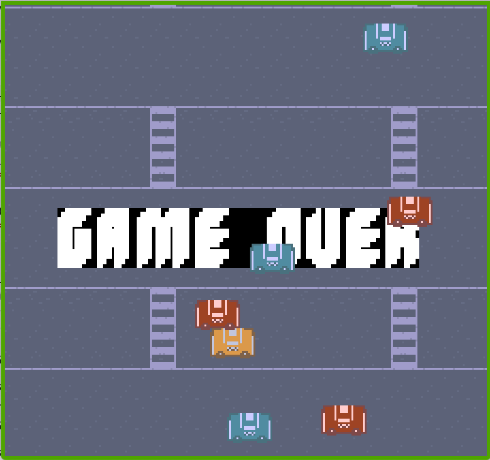

# Don't Crash!!

Author: qingyid

Design: 

Screen Shot:

How Your Asset Pipeline Works:

Asset files are in the 'assets/' directory.

Assets are cropped and color compressed using python scripts before loaded into PPU466.

The color compression algorithm ensures that for every 8x8 tile, only four distinct colors exists. For each sprite (32x16), only four distinct colors exist in the entire pixel space.

Functions handling asset loading are defined in 'Sprite.hpp'.

How To Play:

Use the arrow keys to control your yellow car; don't let it crash into other cars.

Sources: (https://www.kenney.nl/assets/rpg-urban-pack)

This game was built with [NEST](NEST.md).

